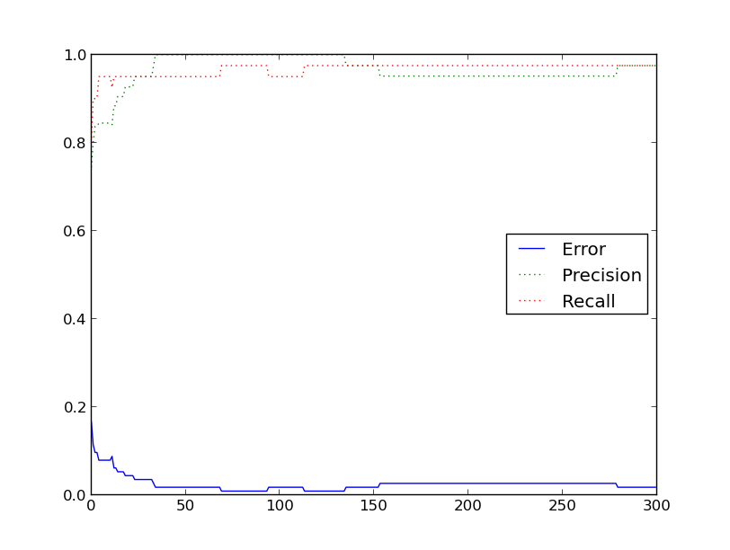

#Нейронная сеть
##Применение нейронных сетей для классификации

1. Реализация нейронной сети
2. Анализ работы на примере датасета *wdbc* (cancer)
3. Применение для распознавания цифр [MNIST]

-----------

#Реализация
Была реализована полносвязная нейронная сеть, с возможностью конфигурировать число слоев и число вершин в каждом слое.
Сеть принимает на вход вектор, описывающий признаки объекта. Выходом сети является вектор длинны предполагаемого количества классов.
Принадлежность какому либо классу определяется по положению максимума в возвращаемом векторе.

Обучение сети выполняется с помощью алгоритма обратного распространения ошибки.

Сеть реализована на языке Java, как наиболее оптимальном, с моей точки зрения, по удобству и скорости работы.
Первоначально была предпринята попытка реализовать сеть на языке Python, но сеть обучалась очень долго.
Обучение сети - долгий процесс, требующий большого количества вычислений, поэтому скорость работы языка программирования далеко не на последнем месте.
Примитивный тест показал что Java работает минимум в 4 раза быстрее.

Помимо этого реализовано выделение главных компонент с помощью обобщенного алгоритма Хебба. Суть его в следующем:
Берем обычный перцептрон, инициируем малыми весами, начинаем подавать данные на вход.
Далее увеличиваем веса тех входов, на которые подается сигнал, и делаем это тем сильнее, чем активнее реакция самого обучаемого перцептрона.
Если нет реакции, то не происходит и обучение. Для предотвращения бесконечного роста весов вектор весов нормируется. Таким образом веса перераспределяются
и настраиваются на узнавание факторов, которые проявляются совместно.
Для выделения k факторов используется k нейронов, каждому следующему передается вектор за вычетом того, что увидели предыдущие перцептроны.

#Анализ работы на примере датасета *wdbc* (cancer)
Вспомним результаты из лабораторной работы для одного перцептрона:

    Perceptron results
    Precision: 93.75%
    Recall: 83.33%

Датасет состоит из записей о клетках. Про каждую известно 30 значений параметров и является ли она злокачественной.
Таким образом получаем сеть с 30 входами и 2 выходами

Датасет делился в отношении обучающая/тестовая выборки = 80/20

##30-30-2
----------

mu=0.1

p = 0.96; r = 0.93; F1 = 0.94

----------

mu=0.01

p = 0.93; r = 0.93; F1 = 0.93

##30-50-30-2
----------

mu=0.1

p = 0.97; r = 0.97; F1 = 0.97

----------

mu=0.01

p = 1; r = 0.95; F1 = 0.97

##30-300-2
----------

mu=0.1

p = 0.97; r = 0.97; F1 = 0.97

----------

mu=0.01

p = 1; r = 0.91; F1 = 0.95

----------

Как видно по результатам, в данном датасете структура сети не оказала заметного влияния на результат.
В то же время сети с большим числом слоев (но меньшим количеством вершин) обучаются ощутимо быстрее, так как связей между нейронами меньше.

##Гланые компоненты
Посмотрим на датасет в главных компонентах, полученных с помощью обобщенного алгоритма Хебба

На рисунках синим обозначены здоровые клетки, красным - злокачественные.
Можно заметить что выборка достаточно неплохо линейно разделима, имеются ярко выраженные 2 кластера.
Это подтверждается и результатами, полученными для одного перцептрона.

#Распознавание цифр [MNIST]
Перейдем к распознаванию рукописных цифр. В датасете представлены 60000 рукописных цифр от 0 до 9.
Каждая цифра представлена в виде картинки 28*28 пикселей, градации серого (256 значений).
Изображения отцентрованы, каждая цифра выровнена по размеру 20*20 пикселей.

Данная задача сильно сложнее предыдущей. Во-первых вектор входных значений длиннее в 26 раз. Размеры скрытых слоев тоже должны быть больших размеровь,
так как функция явно сложная и сильно нелинейная.
Во-вторых входных данных очень много, обучение на полной тренировочной выборке занимает очень много времени. Даже одна полная итерация занимает несколько часов.

Попробуем применить алгоритм Хебба

Видно, что присутствуют выраженные отклонения для 0 (синие), 1 (красные), 7 (белые). В целом же точки сильно перемешаны, что подтверждает сложность задачи.

На сайте показано что сеть с одним скрытым слоем в 300 нейронов показала результат в 4.7% ошибок.
Попробуем сети *784-300-10* и *784-100-100-100-10*
Для ускорения сети тренировались на 800 первых образцах из тренировочной выборки, тестировались на 200 из тестовой

Как видно, присутствует ярко выраженная фаза обучения (которая начинается не обязательно сразу), после чего сеть сходится к некоторому локальному минимуму и дальше не обучается.

Посмотрим на ошибки на тренировочных данных:

Видно, что нейронная сеть *100-100-100* хорошо выучила свои тренировочные примеры (меньше 1% ошибок), тогда как сеть с
скрытым слоем из *300* элементов "зависла" в локальном минимуме. Скорее всего это обусловлено начальными значениями весов, то есть второй сети просто "не повезло".

##Выводы
Нейронные сети хороши тем, что занимают не так много места в памяти, и быстро работают в обученном режиме.
Основная проблема состоит в том как их правильно обучить. Правильно выбирать нужную структуру сети до сих пор не научились,
особенно если мало известно о входных данных. Перебирать различные варианты тоже проблематично, ввиду длительности обучения каждого экземпляра сети.

В задаче распознавания цифр мы столкнулись с тем, что сеть хорошо выучила свой тренировочный датасет, но в тестовом допускает 20% ошибок.
Это объясняется тем, что такая структура сети очень подвержена небольшим изменениям и отклонениям во входных изображениях.
С такой задачей куда успешнее справляются *сверточные сети*: они выделяют из данных факторы небольшого размера, и ищут их на всем изображении.
При этом количество связей в них сильно меньше, что способствует более быстрому их обучению.

[MNIST]: http://yann.lecun.com/exdb/mnist/
